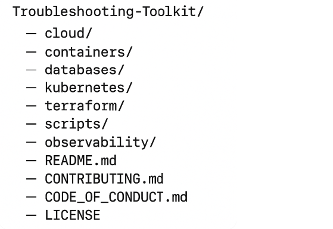

# DevOps Troubleshooting Toolkit

A curated, category-based collection of the **most common bottlenecks** DevOps teams face across the stack. This toolkit helps you rapidly diagnose and fix problems so your team can spend less time firefighting and more time delivering value.

---

## What You'll Find Inside

## Folder Overview

Each folder contains:

- **15–20 of the most common bottlenecks** in that category  
- **Root cause explanations** for each issue  
- **Tools and commands** to help you diagnose and resolve problems  
- **Sample scripts** for automation or manual remediation steps  

| Folder         | Description                                                  |
|----------------|--------------------------------------------------------------|
| [`cloud/`](cloud/bottlenecks.md)       | Troubleshooting issues in AWS, GCP, Azure, and hybrid cloud setups |
| [`containers/`](containers/bottlenecks.md)  | Bottlenecks in Docker, Podman, and containerized apps        |
| [`databases/`](databases/bottlenecks.md)   | Common performance and config problems in SQL/NoSQL systems  |
| [`kubernetes/`](kubernetes/bottlenecks.md)  | Issues with pods, services, RBAC, and resource limits        |
| [`terraform/`](terraform/bottlenecks.md)   | State conflicts, drift, and provider-level deployment issues |
| [`linux/`](linux/bottlenecks.md)       | OS-level problems like permissions, disk I/O, and processes  |
| [`observability/`](observability/bottlenecks.md) | Gaps in monitoring, metrics, logs, alerts, and dashboards  |
| `scripts/`     | Automation utilities to fix or detect known bottlenecks      |
| `assets/`      | Diagrams, screenshots, or media supporting toolkit content   |

---

## Why Use This?

When systems break, engineers scramble. This toolkit exists to:

- Speed up root cause analysis  
- Reduce mean time to resolution (MTTR)  
- Enable proactive monitoring  
- Share tribal knowledge  
- Help you focus on what really matters: your mission

Whether you’re a solo SRE or part of a platform team, this toolkit will give you the clarity and tools to debug with confidence.

---

## Repository Structure

---

## Contribute

We welcome contributions! Fix gaps, add use cases, or contribute scripts. Read [CONTRIBUTING.md](CONTRIBUTING.md) to get started.

## License

This project is licensed under the [MIT License](LICENSE).

---

## Hi, I'm Emmanuel Naweji

**Cloud | DevOps | SRE | FinOps | AI Engineer**  

I help businesses modernize and secure their infrastructure while mentoring engineers to reach top 1% career paths. My approach is rooted in real-world projects, automation-first strategies, and a deep commitment to excellence in everything from architecture to execution.

